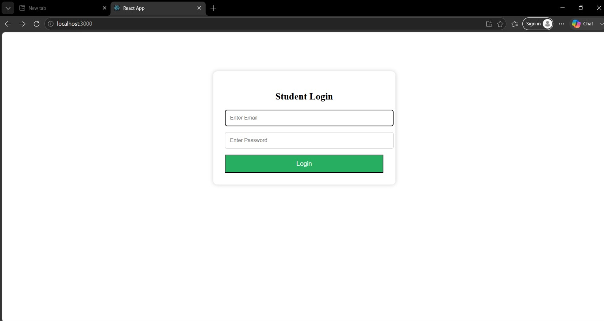
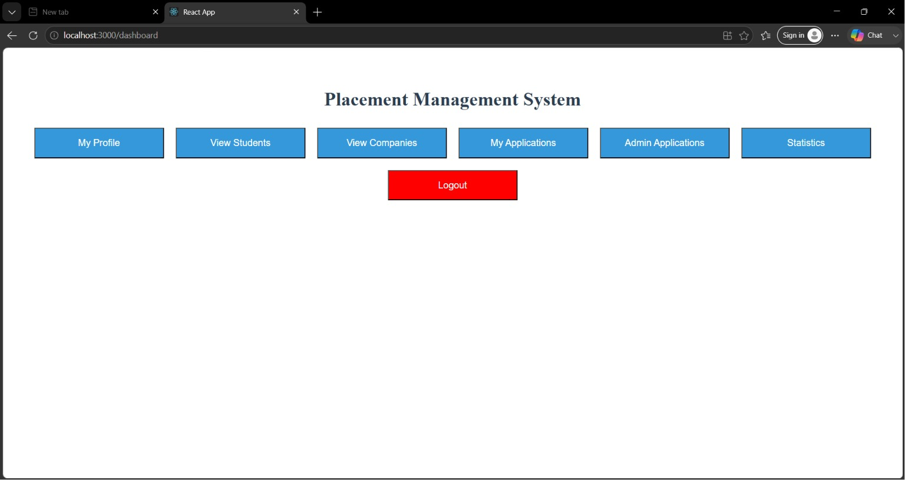
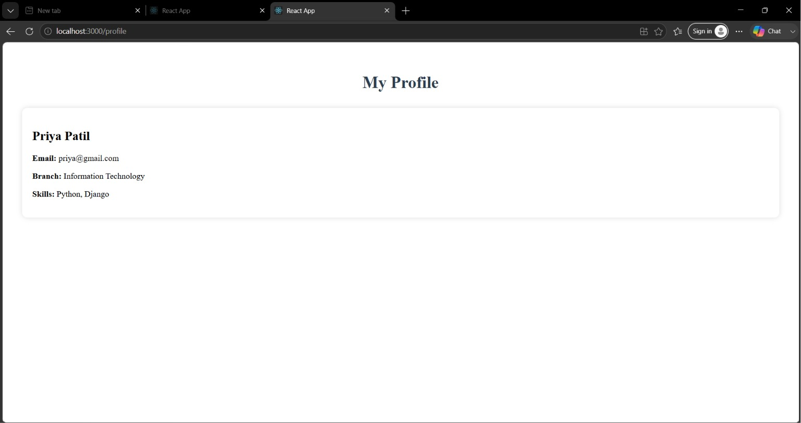
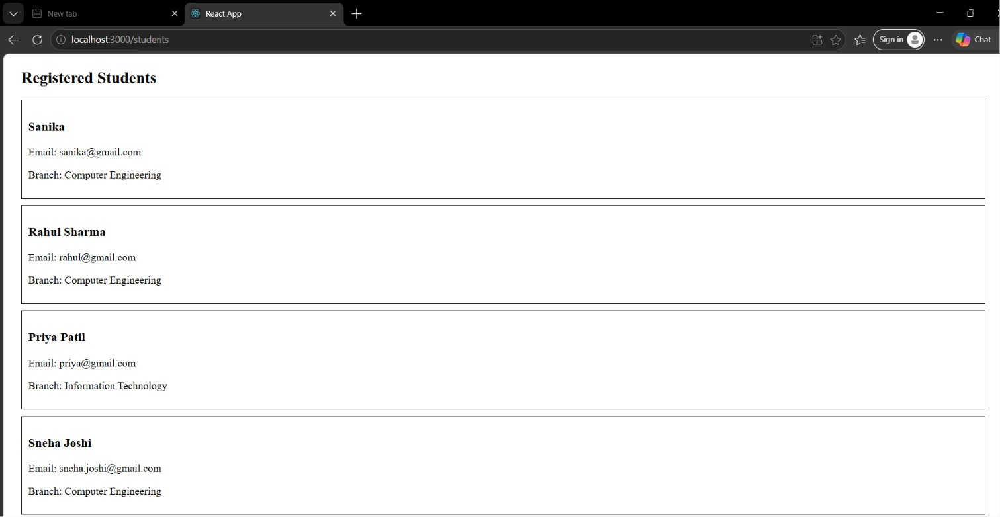
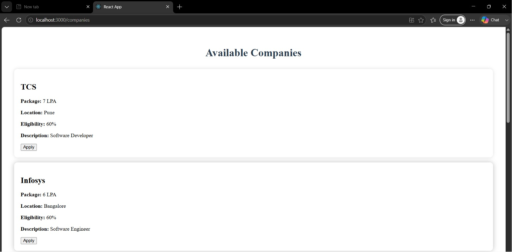
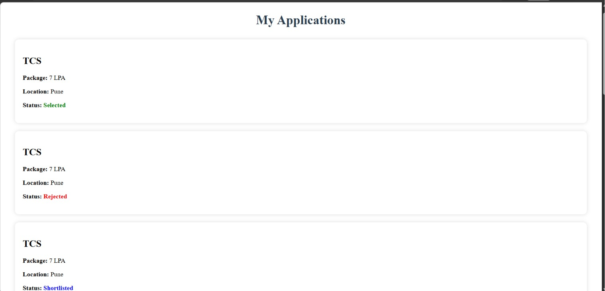
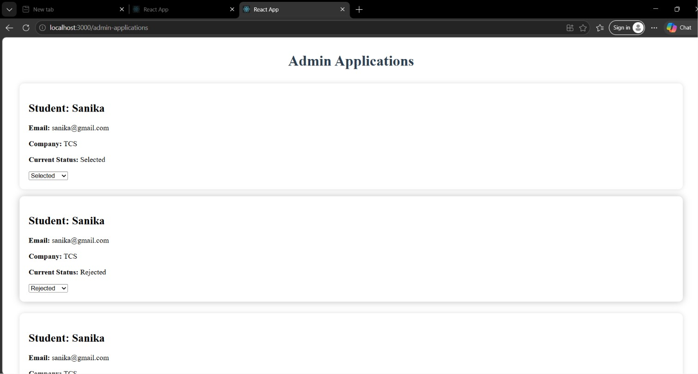
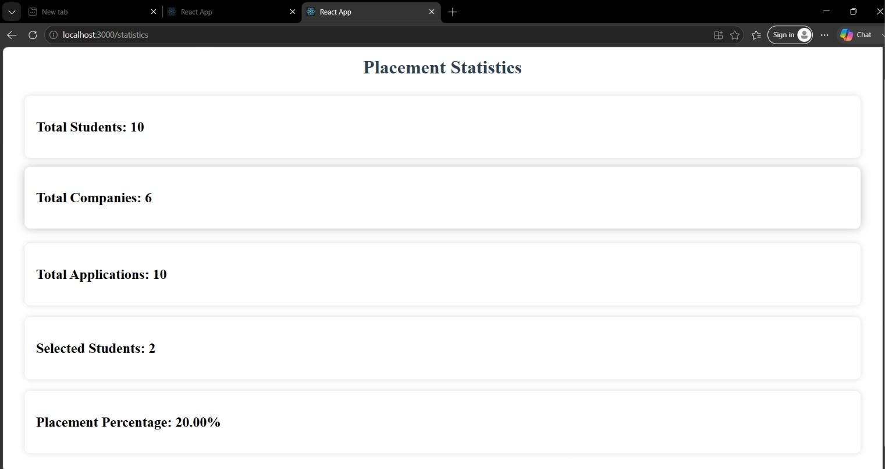

# 🎓 Placement Management System

A full-stack **MERN (MongoDB, Express.js, React.js, Node.js)** web application designed to streamline the campus placement process. The system enables students to browse companies, apply for job opportunities, track application status, and allows administrators to efficiently manage recruitment activities.

---

## 🚀 Features

### 👨‍🎓 Student Module

* Student Registration
* Secure Login with JWT Authentication
* View and Update Student Profile
* Browse Available Companies
* Apply for Job Opportunities
* Track Application Status

### 🏢 Company Module

* Add Company Details
* View Company Information
* Manage Recruitment Opportunities

### 📋 Application Module

* Submit Job Applications
* Prevent Duplicate Applications
* Track Application Status in Real-Time

### 👨‍💼 Admin Module

* View All Applications
* Update Application Status:

  * Applied
  * Shortlisted
  * Selected
  * Rejected
* Manage Students and Companies

### 📊 Statistics Dashboard

* Total Students
* Total Companies
* Total Applications
* Selected Students
* Placement Percentage

---

## 🛠️ Technologies Used

### Frontend

* React.js
* React Router DOM
* Axios
* CSS3

### Backend

* Node.js
* Express.js

### Database

* MongoDB Atlas
* Mongoose

### Authentication & Security

* JSON Web Token (JWT)
* bcryptjs

### Version Control

* Git
* GitHub

---

## 🏗️ System Architecture

```text
Student/Admin
      │
      ▼
React Frontend
      │
      ▼
 Express API
      │
      ▼
MongoDB Atlas
```

---

## 📂 Project Structure

```text
Placement-Management-System
│
├── backend
│   ├── controllers
│   ├── middleware
│   ├── models
│   ├── routes
│   ├── .env
│   └── server.js
│
├── frontend
│   ├── public
│   ├── src
│   │   ├── pages
│   │   ├── styles
│   │   └── App.js
│
├── screenshots
│
└── README.md
```

---

## ⚙️ Installation & Setup

### 1. Clone the Repository

```bash
git clone https://github.com/bhosalesanika72/Placement-Management-System.git
cd Placement-Management-System
```

### 2. Backend Setup

```bash
cd backend
npm install
npm start
```

### 3. Frontend Setup

Open a new terminal and run:

```bash
cd frontend
npm install
npm start
```

---

## 🔐 Environment Variables

Create a `.env` file inside the `backend` directory and add the following:

```env
PORT=5000
MONGO_URI=YOUR_MONGODB_CONNECTION_STRING
JWT_SECRET=YOUR_SECRET_KEY
```

---

## 📸 Project Screenshots

### Login Page



### Dashboard



### Profile Page



### Students Page



### Companies Page



### My Applications



### Admin Applications



### Statistics Dashboard



---

## 📊 Key Achievements

* Implemented secure JWT-based Authentication.
* Enabled students to apply for placement opportunities.
* Developed an application tracking system.
* Created an admin panel for managing application statuses.
* Integrated MongoDB Atlas for cloud database management.
* Built a responsive and user-friendly interface using React.js.
* Developed a dynamic statistics dashboard for placement analytics.

---

## 🔮 Future Enhancements

* Resume Upload Feature
* Interview Scheduling Module
* Email Notifications
* Role-Based Access Control (RBAC)
* Advanced Admin Analytics Dashboard
* PDF Report Generation
* AI-Based Resume Screening and Review

---

## 👩‍💻 Developer

**Sanika Bhosale**

GitHub: https://github.com/bhosalesanika72

LinkedIn: *Add your LinkedIn profile link here*

---

## ⭐ Conclusion

The **Placement Management System** provides a centralized platform for managing campus recruitment activities. It demonstrates full-stack web development using the MERN stack and showcases key concepts such as authentication, RESTful APIs, database management, application tracking, and responsive UI design.

If you found this project useful, don't forget to ⭐ the repository!
